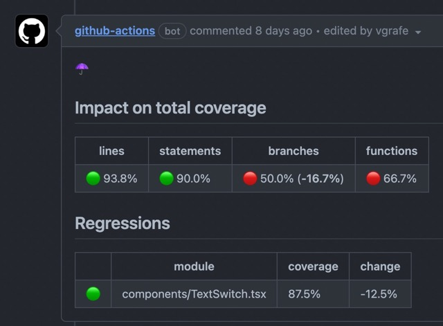

# What it does

Posts coverage report in a comment on your PR, or in a commit when pushing to your default branch.



## Features

- can be run on both PR and pushes on main
- on a PR, it will compare coverage with base branch
  - 2x faster than other actions on the marketplace thanks to aggressive caching
- coming soon:
  - sharded tests support
  - better handling of github's 50 limit on annotations

## Usage

```yml
name: jest-reports
on:
  push:
    branches:
      - main
  pull_request:

jobs:
  compare-cov:
    runs-on: ubuntu-latest
    steps:
      - uses: vgrafe/jest-reports@v0.1.5
```

## Options

```yml
with:
  github-token:
    description: "A github access token"
    default: ${{ github.token }}
  scope:
    description: "Set the scope of the jest run: all, changed in PR, changed since last successful run on the PR"
    default: "all"
    options:
      - all
      - pr-changes
      - changes-since-last-success
  run-steps:
    description: "skip any step by removing the corresponging item from this comma-separated list"
    default: "compare-with-base-branch,report-on-github,annotations-changes,annotations-all"
```
